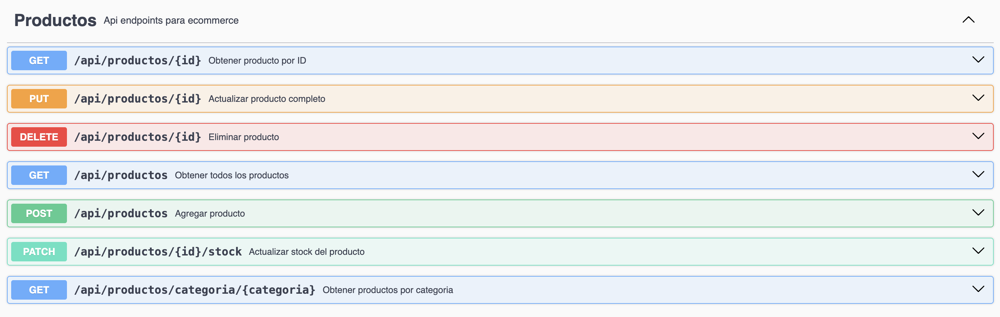
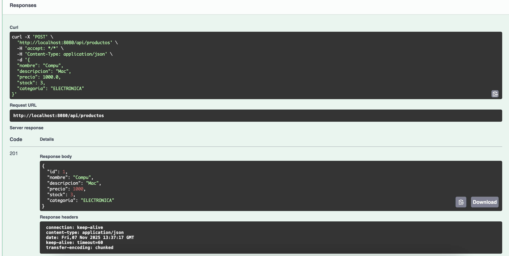
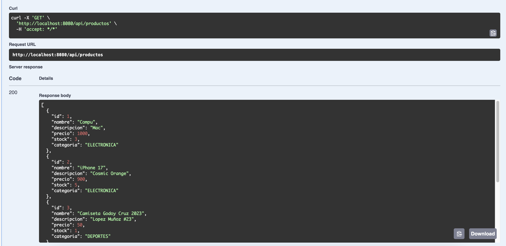
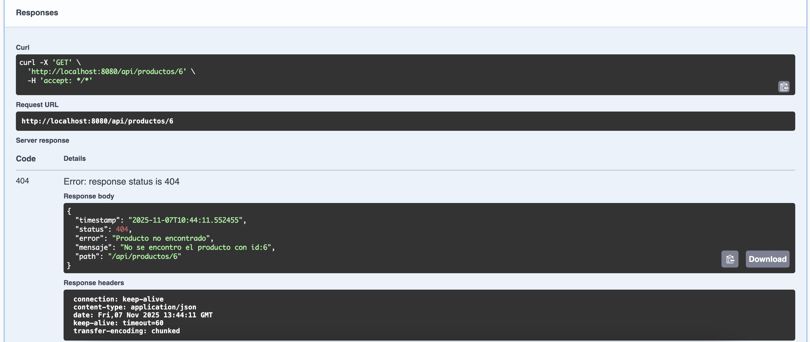
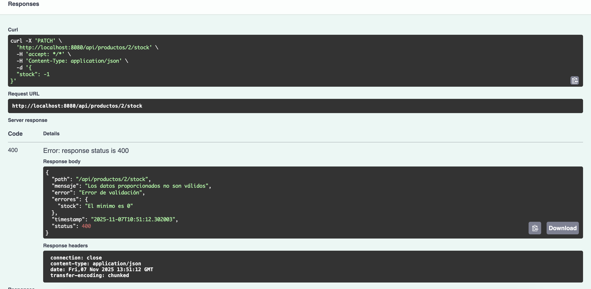
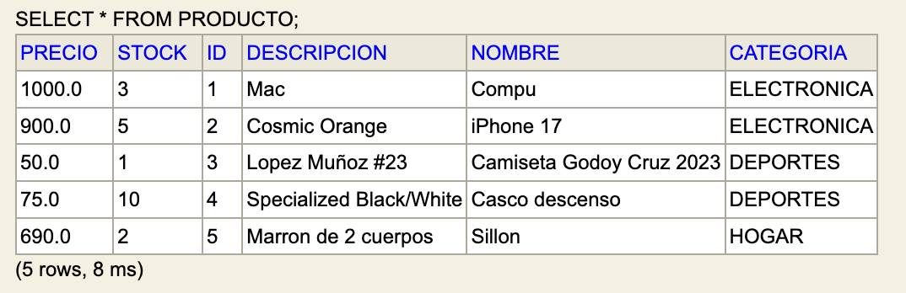

# 🛒 API REST de Gestión de Productos - Spring Boot

## 📄 Descripción del Proyecto

API REST completa para gestión de productos en un sistema de e-commerce básico. Implementa todos los conceptos de desarrollo de APIs REST profesionales con Spring Boot:

- ✅ Arquitectura en capas (Controller, Service, Repository, Entity)
- ✅ Persistencia con Spring Data JPA y H2
- ✅ DTOs con validaciones Bean Validation
- ✅ **Uso de Lombok y Java Records** para código limpio y moderno
- ✅ Manejo centralizado de excepciones
- ✅ Documentación interactiva con Swagger/OpenAPI
- ✅ Operaciones CRUD completas con todos los métodos HTTP

---

## ⚙️ Tecnologías Utilizadas

| Tecnología | Descripción |
|------------|-------------|
| Java | Lenguaje de programación |
| Spring Boot | Framework principal |
| Spring Data JPA | Persistencia de datos |
| H2 Database | Base de datos en memoria |
| Bean Validation | Validación de datos |
| Springdoc OpenAPI | Documentación Swagger |
| Gradle |  Gestión de dependencias |
| Lombok | Reducción de boilerplate |

---

## 🏗️ Estructura del Proyecto

```
productos-api/
├── src/main/java/com/utn/productos/
│   ├── model/
│   │   ├── Categoria.java              # Enum de categorías
│   │   └── Producto.java               # Entidad JPA con Lombok
│   ├── dto/
│   │   ├── ProductoDTO.java            # DTO con Lombok para crear/actualizar
│   │   ├── ProductoResponseDTO.java    # Record para respuestas
│   │   └── ActualizarStockDTO.java     # DTO con Lombok para PATCH de stock
│   ├── repository/
│   │   └── ProductoRepository.java     # Interfaz JPA Repository
│   ├── service/
│   │   └── ProductoService.java        # Lógica de negocio
│   ├── controller/
│   │   └── ProductoController.java     # Endpoints REST
│   ├── exception/
│   │   ├── ProductoNotFoundException.java
│   │   ├── StockInsuficienteException.java
│   │   ├── ErrorResponse.java
│   │   └── GlobalExceptionHandler.java
│   └── ProductosApiApplication.java    # Clase principal
├── src/main/resources/
│   └── application.properties          # Configuración
└── pom.xml
```

---

## 🌐 Endpoints de la API

| Método | Ruta | Descripción |
|--------|------|-------------|
| GET | `/api/productos` | Listar todos los productos |
| GET | `/api/productos/{id}` | Obtener producto por ID |
| GET | `/api/productos/categoria/{categoria}` | Filtrar por categoría |
| POST | `/api/productos` | Crear nuevo producto |
| PUT | `/api/productos/{id}` | Actualizar producto completo |
| PATCH | `/api/productos/{id}/stock` | Actualizar solo el stock |
| DELETE | `/api/productos/{id}` | Eliminar producto |

---

## 📝 Ejemplos de Uso

### Crear un Producto (POST)

```bash
curl -X POST http://localhost:8080/api/productos \
  -H "Content-Type: application/json" \
  -d '{
    "nombre": "iPhone 17",
    "descripcion": "Cosmic Orange",
    "precio": 900,
    "stock": 5,
    "categoria": "ELECTRONICA"
  }'
```

### Obtener Todos los Productos (GET)

```bash
curl http://localhost:8080/api/productos
```

### Actualizar Stock (PATCH)

```bash
curl -X PATCH http://localhost:8080/api/productos/1/stock \
  -H "Content-Type: application/json" \
  -d '{"stock": 15}'
```

### Filtrar por Categoría (GET)

```bash
curl http://localhost:8080/api/productos/categoria/ELECTRONICA
```

---

## 📚 Documentación Swagger

La API incluye documentación interactiva completa con Swagger UI.

**Acceso**: `http://localhost:8080/swagger-ui/index.html`

Desde Swagger UI puedes:
- Ver todos los endpoints documentados
- Probar cada endpoint directamente desde el navegador
- Ver esquemas de DTOs y respuestas
- Revisar códigos de estado HTTP posibles

---

## 🗄️ Consola H2

La base de datos H2 incluye una consola web para ver y consultar datos.

**Acceso**: `http://localhost:8080/h2-console`

**Configuración de conexión**:
- JDBC URL: `jdbc:h2:mem:productosdb`
- User Name: `sa`
- Password: (dejar vacío)

### Consultas SQL de Ejemplo

```sql
-- Ver todos los productos
SELECT * FROM productos;

-- Contar productos por categoría
SELECT categoria, COUNT(*) FROM productos GROUP BY categoria;

-- Productos con stock bajo
SELECT * FROM productos WHERE stock < 5;
```

---

## 🎯 Funcionalidades Implementadas

### Modelo de Datos
- ✅ Entidad `Producto` con anotaciones JPA y Lombok (`@Getter`, `@Setter`, `@NoArgsConstructor`, `@AllArgsConstructor`, `@ToString`)
- ✅ Enum `Categoria` con 5 categorías predefinidas
- ✅ Generación automática de IDs con `@GeneratedValue`

### DTOs y Validación
- ✅ `ProductoDTO`: clase con Lombok y validaciones completas (nombre, precio, stock, categoría)
- ✅ `ProductoResponseDTO`: **record de Java** para respuestas inmutables (mejor práctica)
- ✅ `ActualizarStockDTO`: clase con Lombok para operaciones PATCH
- ✅ Mapeo manual con métodos estáticos (sin librerías externas)

### Capa de Persistencia
- ✅ `ProductoRepository` extendiendo `JpaRepository`
- ✅ Query method personalizado: `findByCategoria()`
- ✅ Operaciones CRUD automáticas de Spring Data JPA

### Lógica de Negocio
- ✅ Servicio con `@Transactional`
- ✅ Conversión entre DTOs y entidades
- ✅ **Regla de negocio**: no permite eliminar productos con stock > 0

### API REST
- ✅ Controller con `@RequiredArgsConstructor` y todos los métodos HTTP
- ✅ Uso correcto de códigos de estado HTTP
- ✅ `ResponseEntity` para control de respuestas
- ✅ Validación con `@Valid` en endpoints POST/PUT/PATCH

### Manejo de Errores
- ✅ Excepciones personalizadas
- ✅ `@ControllerAdvice` para manejo centralizado
- ✅ Respuestas de error estructuradas con `ErrorResponse`
- ✅ Manejo específico de errores de validación

### Documentación
- ✅ Swagger/OpenAPI con anotaciones completas
- ✅ `@Tag`, `@Operation`, `@ApiResponse` en todos los endpoints
- ✅ Descripciones y ejemplos en parámetros

---

## 📸 Capturas de Pantalla

### Swagger UI - Lista de Endpoints



### Prueba POST - Crear Producto



### Prueba GET - Listar Productos



### Error 404 - Producto No Encontrado



### Error 400 - Validación Fallida



### Consola H2 - Tabla Productos



---